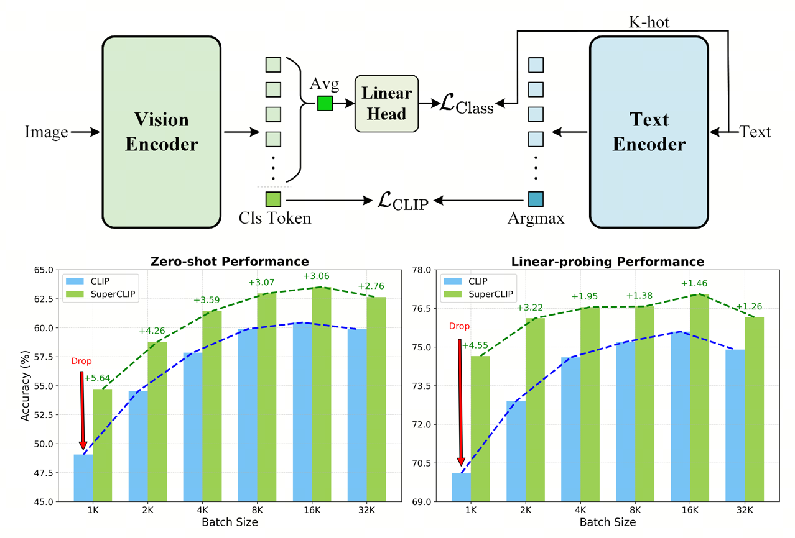

<div align="center">

<h1>SuperCLIP: CLIP with Simple Classification Supervision</h1>

<b>Weiheng Zhao</b><sup>1</sup> · <b>Zilong Huang</b><sup>2</sup> · <b>Xinggang Wang</b><sup>1</sup> · <b>Jiashi Feng</b><sup>2</sup>

HUST Vision Lab<sup>1</sup> & Bytedance<sup>2</sup>

<a href="https://openreview.net/pdf?id=EeIEvZlmVg"></a>


</div>

The reason you should try SuperCLIP:
It offers significant gains with only a **0.077% increase in FLOPs** and **no extra annotated data** needed. It dramatically alleviates the performance drop of CLIP-style models under **small-batch training**, and is fully compatible with modern CLIP variants (e.g., SigLIP, FLIP) while also delivering clear improvements when integrated into multi-modal LLM frameworks like LLaVA.

<div align="center">
  
</div>

---

## Table of Contents
- [News](#news)
- [Getting Started](#getting-started)
  - [Installation](#installation)
  - [Datasets](#datasets)
  - [Configuration](#configuration)
- [Training](#training)
- [Acknowledgments](#acknowledgments)

## News

- 2025-09-19: Accepted by NeurIPS 2025. [✔]
- 2025-11-06: Code release. [✔]

## Getting Started

### Installation

```bash
# Clone the repository
git clone https://github.com/hustvl/SuperCLIP.git
cd SuperCLIP

# Install dependencies
pip install -r requirements.txt
```

### Datasets

- Datacomp-1B: https://github.com/mlfoundations/datacomp
- ImageNet-1K: https://www.image-net.org/download.php

### Configuration

Update the paths in the training script to point to your local datasets:
- Set DATA_PATH to the Datacomp-1B root.
- Set VAL_DATA_PATH to the ImageNet-1K validation set.

File to edit: train.sh

## Training

Start SuperCLIP training with:

```bash
bash train.sh <config_path> superclip
```

## Acknowledgments

Our codebase is built upon:
- OpenCLIP: https://github.com/mlfoundations/open_clip
- SuperClass: https://github.com/x-cls/superclass?tab=readme-ov-file

We thank the OpenCLIP and SuperClass teams for contributing such impressive code and models to the community.